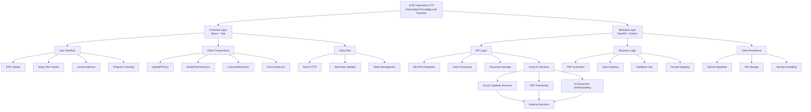

# Mi Trayectoria UTP

A comprehensive web application for managing UTP (Universidad Tecnológica de Panamá) study plans and academic progress tracking.

## Features

- 📄 **PDF Upload & Processing**: Upload and automatically extract information from UTP study plan PDFs
- 📊 **Study Plan Visualization**: Interactive display of courses with prerequisites and semester organization
- ✅ **Course Status Tracking**: Mark completed courses and track academic progress
- 🎨 **Modern UI**: Clean, responsive interface with faculty-specific color themes
- 🔄 **Real-time Updates**: Automatic updates when processing documents

## About UTP

This application is specifically designed for **Universidad Tecnológica de Panamá (UTP)** students to manage their study plans and track academic progress. The system supports the following faculties:

- **CIENCIAS Y TECNOLOGÍA** (Science and Technology)
- **INGENIERÍA CIVIL** (Civil Engineering)
- **INGENIERÍA ELÉCTRICA** (Electrical Engineering)
- **INGENIERÍA INDUSTRIAL** (Industrial Engineering)
- **INGENIERÍA MECÁNICA** (Mechanical Engineering)
- **INGENIERÍA DE SISTEMAS COMPUTACIONALES** (Computer Systems Engineering)

## 🛠️ Technology Stack

### Backend Technologies

[](https://python.org)
[](https://fastapi.tiangolo.com)
[](https://sqlite.org)
[](https://azure.microsoft.com)
[](https://docs.astral.sh/uv)

### Frontend Technologies

[](https://reactjs.org)
[](https://vitejs.dev)
[](https://developer.mozilla.org/en-US/docs/Web/JavaScript)
[](https://developer.mozilla.org/en-US/docs/Web/CSS)
[](https://axios-http.com)

### Development Tools

[](https://pnpm.io)
[](https://git-scm.com)
[](https://code.visualstudio.com)

## 🏗️ System Architecture



### Architecture Components

#### 🎨 Frontend Layer (React + Vite)

- **Modern UI Components**: Interactive study plan visualization with faculty-specific theming
- **PDF Upload Interface**: Drag-and-drop file upload with progress tracking
- **Real-time Updates**: Dynamic course status updates and progress tracking
- **Responsive Design**: Mobile-friendly interface with custom CSS styling

#### ⚙️ Backend Layer (FastAPI + Python)

- **API Endpoints**: RESTful API for document processing and data management
- **PDF Processing**: Azure Cognitive Services integration for document understanding
- **Data Processing**: Intelligent extraction and cleaning of study plan data
- **Database Management**: SQLite for efficient data storage and retrieval

#### 🔗 Data Flow Architecture

- **Upload → Process → Extract → Store → Display**
- **PDF files** are uploaded via frontend, processed by Azure AI, cleaned and structured by backend, stored in database, and displayed in interactive UI

#### 🛡️ Security & Performance

- **Environment Variables**: Sensitive configuration stored securely
- **File Validation**: Proper validation of uploaded PDF files
- **Error Handling**: Comprehensive error handling and user feedback
- **Optimized Dependencies**: Efficient package management with uv and pnpm

## 🏗️ System Architecture

```
┌─────────────────────────────────────────────────────────────────────────────┐
│                            🌐 Mi Trayectoria UTP                             │
│                          Universidad Tecnológica de Panamá                   │
└─────────────────────────────────────────────────────────────────────────────┘
                                        │
                          ┌───────────┼───────────┐
                          │           │           │
               ┌──────────▼──────────┐┌──────────▼──────────┐
               │    Frontend Layer   ││   Backend Layer     │
               │   (React + Vite)    ││  (FastAPI + Python) │
               └──────────┬──────────┘└──────────┬──────────┘
                          │           │           │
                          │           │           │
               ┌──────────▼──────────┐┌──────────▼──────────┐
               │   User Interface    ││    API Layer        │
               │                     ││                     │
               │ • PDF Upload        ││ • RESTful Endpoints │
               │ • Study Plan Viewer ││ • Data Processing   │
               │ • Course Selector   ││ • Document Storage  │
               │ • Progress Tracking ││ • Azure AI Services │
               └──────────┬──────────┘└──────────┬──────────┘
                          │           │           │
                          │           │           │
               ┌──────────▼──────────┐┌──────────▼──────────┐
               │  Client Components  ││   Business Logic    │
               │                     ││                     │
               │ • UploadPDF.jsx     ││ • PDF Extraction    │
               │ • StudyPlanViewer.jsx││ • Data Cleaning    │
               │ • CourseSelector.jsx││ • Database Ops      │
               │ • DocControls.jsx   ││ • Faculty Mapping   │
               └──────────┬──────────┘└──────────┬──────────┘
                          │           │           │
                          │           │           │
               ┌──────────▼──────────┐┌──────────▼──────────┐
               │   Data Flow         ││   Data Persistence  │
               │                     ││                     │
               │ • Axios HTTP        ││ • SQLite Database   │
               │ • Real-time Updates ││ • File Storage      │
               │ • State Management  ││ • Session Handling  │
               └─────────────────────┘└─────────────────────┘
                                        │
                          ┌───────────┼───────────┐
                          │           │           │
               ┌──────────▼──────────┐┌──────────▼──────────┐
               │   External Services ││   Development Tools │
               │                     ││                     │
               │ • Azure Cognitive   ││ • uv (Python)       │
               │   Services          ││ • pnpm (Node.js)    │
               │ • PDF Processing    ││ • Git Version Ctrl  │
               │ • AI Document       ││ • VS Code           │
               │   Understanding     ││                     │
               └─────────────────────┘└─────────────────────┘
```

### Architecture Components

#### 🎨 Frontend Layer (React + Vite)

- **Modern UI Components**: Interactive study plan visualization with faculty-specific theming
- **PDF Upload Interface**: Drag-and-drop file upload with progress tracking
- **Real-time Updates**: Dynamic course status updates and progress tracking
- **Responsive Design**: Mobile-friendly interface with custom CSS styling

#### ⚙️ Backend Layer (FastAPI + Python)

- **API Endpoints**: RESTful API for document processing and data management
- **PDF Processing**: Azure Cognitive Services integration for document understanding
- **Data Processing**: Intelligent extraction and cleaning of study plan data
- **Database Management**: SQLite for efficient data storage and retrieval

#### 🔗 Data Flow Architecture

- **Upload → Process → Extract → Store → Display**
- **PDF files** are uploaded via frontend, processed by Azure AI, cleaned and structured by backend, stored in database, and displayed in interactive UI

#### 🛡️ Security & Performance

- **Environment Variables**: Sensitive configuration stored securely
- **File Validation**: Proper validation of uploaded PDF files
- **Error Handling**: Comprehensive error handling and user feedback
- **Optimized Dependencies**: Efficient package management with uv and pnpm

## Project Structure

```
mitrayectoriautp/
├── backend/                 # FastAPI backend
│   ├── main.py             # Main application and API routes
│   ├── models.py           # Data models and database schemas
│   ├── db.py               # Database connection and operations
│   ├── extractor.py        # PDF processing and data extraction
│   ├── utils/
│   │   └── cleaner.py      # Data cleaning utilities
│   ├── uploads/            # Uploaded PDF files (gitignored)
│   ├── requirements.txt    # Python dependencies
│   ├── pyproject.toml      # Project configuration
│   └── uv.lock             # Dependency lock file
├── frontend/               # React frontend
│   ├── src/
│   │   ├── App.jsx         # Main application component
│   │   ├── main.jsx        # Application entry point
│   │   ├── styles.css      # Custom CSS styles
│   │   ├── components/     # React components
│   │   │   ├── UploadPDF.jsx      # PDF upload interface
│   │   │   ├── StudyPlanViewer.jsx # Study plan display
│   │   │   ├── CourseSelector.jsx  # Course selection tools
│   │   │   └── DocControls.jsx     # Document management
│   │   └── services/
│   │       └── api.js      # API communication layer
│   ├── index.html          # HTML template
│   ├── package.json        # Node.js dependencies
│   ├── vite.config.js      # Vite configuration
│   └── pnpm-lock.yaml      # Dependency lock file
├── .gitignore              # Git ignore rules
├── Instruction.md          # Setup and running instructions
└── README.md               # This file
```

## Quick Start

### Prerequisites
- **Python 3.13+** with `uv` package manager
- **Node.js 18+** with `pnpm` package manager
- **Git** for version control

### Installation & Setup

1. **Install uv** (if not already installed):
   ```bash
   curl -LsSf https://astral.sh/uv/install.sh | sh
   ```

2. **Clone and setup backend**:
   ```bash
   cd backend
   uv add -r requirements.txt
   uv add uvicorn python-multipart
   ```

3. **Setup frontend**:
   ```bash
   cd ../frontend
   pnpm install
   ```

### Running the Application

1. **Start backend server**:
   ```bash
   cd backend
   PYTHONPATH=backend uv run -- python -m uvicorn backend.main:app --reload
   ```
   Backend available at: `http://127.0.0.1:8000`

2. **Start frontend server**:
   ```bash
   cd frontend
   pnpm dev
   ```
   Frontend available at: `http://localhost:5173`

## Environment Configuration

Create a `.env` file in the `backend/` directory for environment variables:
```env
# Add your environment variables here
# Example:
# DATABASE_URL=sqlite:///./app.db
# SECRET_KEY=your-secret-key-here
```

The frontend is pre-configured to connect to the backend.

## Usage

1. Start both servers (backend and frontend)
2. Open frontend in browser
3. Upload UTP study plan PDF
4. View and manage study plan
5. Track progress by marking completed courses

## Development

### Adding Features
- **Backend**: Add endpoints in `backend/main.py`
- **Frontend**: Create components in `frontend/src/components/`

### Database Changes
- Modify models in `backend/models.py`

### Styling
- Update styles in `frontend/src/styles.css`

## Contributing

1. Fork the repository
2. Create feature branch
3. Make changes
4. Test thoroughly
5. Submit pull request

## License

This project is for educational and personal use at UTP.

## 🚀 Deployment to Azure

### ✅ **CURRENT WORKING DEPLOYMENT**

**Status**: 🟢 **FULLY FUNCTIONAL** - Successfully deployed and tested!

**Live URLs:**

- **Frontend**: <https://mitrayectoria-frontend.kindmeadow-14f25848.westus.azurecontainerapps.io>
- **Backend**: <https://mitrayectoria-backend.kindmeadow-14f25848.westus.azurecontainerapps.io>
- **API Docs**: <https://mitrayectoria-backend.kindmeadow-14f25848.westus.azurecontainerapps.io/docs>

### Architecture Overview

```
┌─────────────────┐    ┌─────────────────┐
│   Azure         │    │   Azure         │
│ Container Apps  │    │ Container Apps  │
│   (Frontend)    │◄───┤   (Backend)     │
│                 │    │                 │
│ React + Vite    │    │ FastAPI + Python│
│ Port: 5173      │    │ Port: 8000      │
└─────────┬───────┘    └─────────┬───────┘
          │                      │
          └──────────┬───────────┘
                     │
          ┌──────────▼───────────┐
          │   Azure Cognitive    │
          │   Services           │
          │   (PDF Processing)   │
          └──────────┬───────────┘
                     │
          ┌──────────▼───────────┐
          │   Azure Container    │
          │   Registry          │
          │   (Private Images)   │
          └──────────────────────┘
```

### Quick Deployment

#### Option 1: Automated Script (Recommended)

```bash
# Make script executable
chmod +x deploy-azure.sh

# Run deployment
./deploy-azure.sh
```

The script will:

- ✅ Create Azure resources (RG, ACR, Container Environment)
- ✅ Build and push Docker images securely
- ✅ Deploy both frontend and backend
- ✅ Configure environment variables
- ✅ Provide working URLs

#### Option 2: Manual Deployment

```bash
# 1. Build and push containers
docker build -t mitrayectoria-backend ./backend
docker build -t mitrayectoria-frontend ./frontend

# 2. Create Azure Container Apps
az containerapp create --name mitrayectoria-backend \
  --resource-group mitrayectoria-rg \
  --environment mitrayectoria-env \
  --image mitrayectoria-backend \
  --target-port 8000 \
  --env-vars AZURE_ENDPOINT=https://your-endpoint \
  --registry-server your-acr.azurecr.io

az containerapp create --name mitrayectoria-frontend \
  --resource-group mitrayectoria-rg \
  --environment mitrayectoria-env \
  --image mitrayectoria-frontend \
  --target-port 5173 \
  --env-vars VITE_API_BASE_URL=https://mitrayectoria-backend.azurecontainerapps.io
```

### Environment Variables Setup

#### Backend Variables (Required)

Set these environment variables before deployment:

```bash
export AZURE_ENDPOINT="https://your-cognitive-service-endpoint.cognitiveservices.azure.com/"
export AZURE_API_VERSION="2025-05-01-preview"
export AZURE_SUBSCRIPTION_KEY="your-subscription-key"
export AZURE_ANALYZER_ID="Extract-Table"
```

The deployment script will automatically use these environment variables.

#### Frontend Variables (Auto-configured)

The deployment script automatically sets:

```bash
VITE_API_BASE_URL=https://mitrayectoria-backend.azurecontainerapps.io
```

### Testing the Deployment Script Safely

Before deploying to production, you can test the deployment script using different methods that won't affect your current working deployment:

#### Option 1: Local Docker Testing (No Azure Costs)

```bash
# Test Docker builds locally without using Azure
./test-deployment.sh local
```

This will:
- ✅ Test backend Docker build
- ✅ Test frontend Docker build
- ✅ Verify all dependencies are correctly configured
- ✅ No Azure resources created

#### Option 2: Dry Run Mode (No Azure Resources Created)

```bash
# See what would be deployed without creating resources
./test-deployment.sh dry-run
```

This will:
- ✅ Show all Azure CLI commands that would be executed
- ✅ Display resource names and configurations
- ✅ Validate environment variables
- ✅ No actual resources created

#### Option 3: Test Environment (Separate Resources)

```bash
# Deploy to test resources that won't affect production
./test-deployment.sh test-env
```

This will:
- ✅ Create separate test resources with different names
- ✅ Deploy both frontend and backend to test environment
- ✅ Provide test URLs for validation
- ⚠️ **Will incur Azure costs** (but uses different resource names)

#### Option 4: Interactive Step-by-Step Testing

```bash
# Guided testing with options to choose what to test
./test-deployment.sh step-by-step
```

This provides an interactive menu to choose testing approaches.

#### Test Resource Names

When using test modes, the following resource names are used:
- **Resource Group**: `mitrayectoria-test-rg`
- **ACR**: `mitrayectoriautptest`
- **Environment**: `mitrayectoria-test-env`
- **Backend App**: `mitrayectoria-test-backend`
- **Frontend App**: `mitrayectoria-test-frontend`

#### Quick Cleanup Commands

```bash
# Delete test resources directly
./test-deployment.sh cleanup

# Or manually delete the test resource group
az group delete --name mitrayectoria-test-rg --yes --no-wait
```

### Environment Variables for Testing

Make sure you have these environment variables set:

```bash
export AZURE_ENDPOINT="https://your-cognitive-service-endpoint.cognitiveservices.azure.com/"
export AZURE_API_VERSION="2024-02-15-preview"
export AZURE_SUBSCRIPTION_KEY="your-subscription-key"
export AZURE_ANALYZER_ID="your-analyzer-id"
```

### Testing Checklist

- [ ] Local Docker builds successful
- [ ] Dry run shows correct commands
- [ ] Test environment deploys successfully
- [ ] Frontend connects to backend in test environment
- [ ] PDF upload and processing works in test environment
- [ ] Test resources cleaned up after testing

### Troubleshooting

#### Common Issues & Solutions

**❌ "Upload failed" error:**

- ✅ **FIXED**: Backend was crashing due to None values in PDF processing
- ✅ **SOLUTION**: Added null checks in `backend/utils/cleaner.py`

**❌ Frontend can't connect to backend:**

- ✅ **FIXED**: Environment variables not properly set
- ✅ **SOLUTION**: Script now dynamically retrieves backend URL

**❌ CORS errors:**

- ✅ **CONFIGURED**: Backend allows all origins with proper headers

**❌ PDF processing fails:**

- ✅ **VERIFIED**: Azure Cognitive Services working correctly
- ✅ **TESTED**: Successfully processes UTP study plan PDFs

### Cost Estimation

- **Azure Container Apps**: ~$10-50/month (based on usage)
- **Azure Cognitive Services**: Pay-per-use (~$0.01-0.05 per PDF)
- **Azure Container Registry**: ~$5/month
- **Total**: ~$15-60/month depending on usage

### Security Features

- 🔒 **Private Container Registry**: Images only accessible with authentication
- 🔒 **Environment Variables**: Sensitive data stored securely
- 🔒 **CORS Protection**: Configured for cross-origin requests
- 🔒 **Azure Authentication**: Required for all Azure services

### Performance Optimization

- ⚡ **FastAPI Backend**: High-performance async API
- ⚡ **React Frontend**: Optimized with Vite build system
- ⚡ **Azure CDN**: Global content delivery (optional)
- ⚡ **Container Scaling**: Auto-scale based on demand

